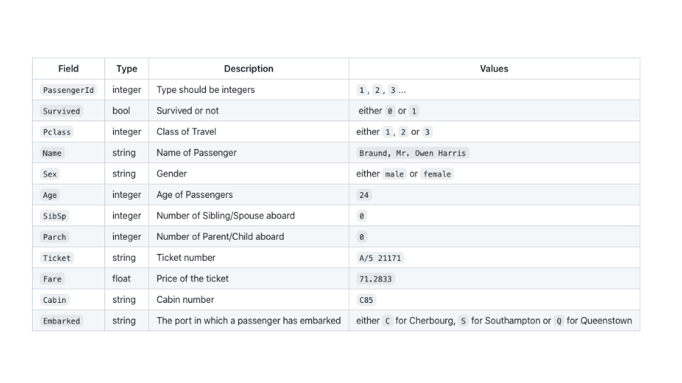

<!--

The paper.md, bibtex and figure file can be found in this repo:

  https://github.com/journal-of-research-objects/Example-BioHackrXiv-Paper

To modify, please clone the repo. You can generate PDF of the paper by
pasting above link (or yours) in

  http://biohackrxiv.genenetwork.org/

-->

# Introduction
The COVID-19 crisis demonstrates a critical requirement for rapid and efficient sharing of data to facilitate the global response to this and future pandemics. We can address this challenge by making viral genomic and patient phenomic data FAIR, and formalising it to permit seamless data integration for facilitating data analysis. Phenopackets is a standard file format for sharing phenotypic information that facilitates communication within the research and clinical genomics communities [@jacobsen2022a]. The Observational Medical Outcomes Partnership (OMOP) Common Data Model allows for large-scale analysis of distributed data to generate evidence for research that promotes better health decisions and better care [@overhage2012a]. These gathered data is used by epidemiologists to monitor the infection, model it and make outbreak analysis and predictions to evaluate policy interventions. To harness Machine Learning (ML) and Artificial Intelligence (AI) approaches to discover meaningful patterns in epidemic outbreaks, we need to ensure that data are FAIR, i.e. data and metadata are accessible and actionable by machines. To leverage data for federated learning/analytics, datasets can be discovered in FAIR Data Points; FAIR data repositories that publish human- and machine-readable metadata for data resources. This project aims to enhance interoperability between health and research data by mapping Phenopackets and OMOP and representing COVID-19 metadata using the FAIR principles to enable discovery, integration and analysis of genotypic and phenotypic data.


<!--
# Results
-->

## OMOP to Phenopackets
In order to accomplish the mapping between OMOP CDR and Phenopackets the availability of data in OMOP CDR format is extremely useful. However, due to the extreme sensitivity of real patients data, artificial data have been preferred over real ones.

### Population of OMOP CDR tables with synthetic patients data
The process of populating the OMOP CDR tables of a database can roughly be divided into four steps:
1. Creation of patients data
2. Database deployment
3. Vocabularies retrieval
5. Transfer of patients data and vocabularies to DB

The choice of the tools needed to accomplish these tasks was facilitated by the familiarity of some group member with Synthea[^1], an open-source, synthetic patient generator. In fact, Synthea has an extension called ETL-Synthea[^2] that loads the data created by the former into a PostgreSQL database, set with OMOP CDR schema.

The first step makes use of Synthea version 2.7[^3]. Once downloaded the jar and the source from the link, a comma separated values (CSV) file with 1000 patients can be created with:
```
java -jar synthea-with-dependencies.jar -p 1000 -c /pathtosynthea/src/main/resources/synthea.properties
```
where synthea.properties, located in the source code in /pathtosynthea/synthea/src/main/resources/, must be edited in order to export data in csv format.
```
exporter.csv.export = true
```
More recent versions of synthea yield data that can not be ingested by the ETL-Synthea tool only after some columns cutting and editing.

The next step is to set up a Postgres db. Probably the easiest way is to create a docker container. After installing docker and docker-compose a yaml file like the following can be used:
```
version: "3"
services:
  db:
    image: postgres:12.2
    restart: "no"
    shm_size: 256m
    environment:
      POSTGRES_DB: postgres
      POSTGRES_USER: postgres
      POSTGRES_PASSWORD: lollipop
      PGDATA: /var/lib/postgresql/data
    volumes:
      - db-data:/var/lib/postgresql/data
    ports:
      - "5432:5432"

  pgadmin:
    image: dpage/pgadmin4:4.18
    restart: "no"
    environment:
      PGADMIN_DEFAULT_EMAIL: youremail@yourdomain.com
      PGADMIN_DEFAULT_PASSWORD: yourpassword
      PGADMIN_LISTEN_PORT: 80
    ports:
      - "8081:80"
    volumes:
      - pgadmin-data:/var/lib/pgadmin
    links:
      - "db:pgsql-server"
volumes:
  db-data:
  pgadmin-data:
```
The yaml contains the instructions to create the postgres container and a tool for administration connected to it. In order to generate the container:
```
docker-compose up
```
Then, after logging in to the administration tool at http://localhost:8081, it must be created a database called "synthea10" and inside it two schemas named "cdm_synthea10" and "native".

In the third step we chose the athena site[^4] to donwload the vocabularies. Accepting all the default vocabularies resulted in a zip file of over 4 GB and an error later in the fourth step. Reducing the vocabularies zip file dimension under 3 GB solved the issue.

The next step is the actual population of the PostgreSQL db just created with the synthetic data generated in the first step. The command to execute is:
```
Rscript loader_all_master.r
```

where "loader_all_master.r" is similar to:
```
devtools::install_github("OHDSI/ETL-Synthea")
library(ETLSyntheaBuilder)
devtools::install_github("OHDSI/CommonDataModel", "v5.4")
cd <- DatabaseConnector::createConnectionDetails(
  dbms     = "postgresql",
  server   = "172.23.0.2/synthea10",
  pathToDriver = "/tmp/",
  user     = "postgres",
  password = "lollipop",
  port     = 5432
)
cdmSchema      <- "cdm_synthea10"
cdmVersion     <- "5.4"
syntheaVersion <- "2.7.0"
syntheaSchema  <- "native"
syntheaFileLoc <- "/tmp/output/csv"
vocabFileLoc   <- "/tmp/Vocabulary_restricted"

ETLSyntheaBuilder::CreateCDMTables(connectionDetails = cd, cdmSchema = cdmSchema, cdmVersion = cdmVersion)

ETLSyntheaBuilder::CreateSyntheaTables(connectionDetails = cd, syntheaSchema = syntheaSchema, syntheaVersion = syntheaVersion)

ETLSyntheaBuilder::LoadSyntheaTables(connectionDetails = cd, syntheaSchema = syntheaSchema, syntheaFileLoc = syntheaFileLoc)

ETLSyntheaBuilder::LoadVocabFromCsv(connectionDetails = cd, cdmSchema = cdmSchema, vocabFileLoc = vocabFileLoc)

ETLSyntheaBuilder::LoadEventTables(connectionDetails = cd, cdmSchema = cdmSchema, syntheaSchema = syntheaSchema, cdmVersion = cdmVersion, syntheaVersion = syntheaVersion)
```

The actual server address in the server line must be replaced with the ip address of your database container. Some commands to retrieve it are:
```
docker ps #get the db container name e.g. 6cd32142e88c
docker inspect 6cd32142e88c | grep -i IPADD
```
"pathToDriver" have to filled with the path to the postgresql java driver. For the version included in the yaml shown postgresql-42.3.1.jar is the right choice and can be downloaded from https://jdbc.postgresql.org/download.html
"user" and "password" are the same set in the yaml by the name of "POSTGRES_USER" and "POSTGRES_PASSWORD".
"syntheaFileLoc" is the path to the directory containing the synthetic data created with Synthea whereas "vocabFileLoc" points to the path of the directory with the vocabularies.


[^1]:[https://synthetichealth.github.io/synthea/](https://synthetichealth.github.io/synthea/)
[^2]: [https://github.com/OHDSI/ETL-Synthea]( https://github.com/OHDSI/ETL-Synthea)
[^3]:[https://github.com/synthetichealth/synthea/releases/tag/v2.7.0](https://github.com/synthetichealth/synthea/releases/tag/v2.7.0)
[^4]:https://athena.ohdsi.org/vocabulary/


### Mapping OMOP to Phenopackets
In order to create reusable mappings between OMOP and Phenopackets, we first identified the appropriate tables in the OMOP schema for each relevant Phenopacket entity (or "building block"). A number of Phenopacket entities are outside the scope of OMOP, in particular in the area of "Genomic Interpretation". We also excluded the top-level elements of "Family" and "Cohort" as again, these are not within the OMOP scope, which is focused on healthcare data of individual patients.

After an initial review of the two domains, we found that no Phenopacket concept has a direct one-to-one mapping to a single entity in the OMOP CDM. While there are many fields that have a direct equivalence between the two, fields within one Phenopacket entity are usually spread across multiple OMOP tables and vice-versa. In addition, some Phenopackets fields need to be derived or inferred from one or more OMOP fields, especially for time- and date-related fields. For example, Phenopacket's Individual.date\_of\_birth is a concatenation of OMOP's Person.year\_of\_birth, Person.month\_of\_birth and Person.day\_of\_birth if Person.birth\_datetime is not available, while Phenopacket's Treatment.interval.end is derived from OMOP's DrugEra.drug\_exposure\_start\_date and DrugExposure.days\_supply if DrugEra.drug\_exposure\_end\_date is not available. Equally, concepts such as Disease.primary\_site and Disease.laterality need to be derived from multiple entries in the ConditionOccurrence table linked via specific concept relationships.

Differentiating between PhenotypicFeature and Disease posed another mapping challenge as a lot of concept in OMOP ConditionOccurrence are more aligned with the concept of phenotypic feature than disease (eg cerebrovasuclar accident, atrial fibrillation). We were faced with either having to declare a set equivalence between ConditionOccurrence and one of the Phenopacket entities or using query refinements to assess each ConditionOccurrence against ontologies such as HPO and MONDO in order to determine the correct Phenopackets concept for each mapping.

Table 1 shows an overview of the Phenopacket entity to OMOP table mappings. The full list of mappings is available in [here](https://docs.google.com/document/d/1azjdNkqJ31K7voFH7XP5trkQu85B8Hlb4Okop3A_SYk/edit?usp=sharing).

| Phenopacket Entity | OMOP Tables |
| ------------------ | ----------- |
| Individual | Person, VisitOccurrence, Death |
| VitalStatus | Death, Person, ConditionOccurrence |
| PhenotypicFeature| Observation, ConditionOccurrence, ConditionEra |
| Measurement| Measurement, (ProcedureOccurrence) |
| Disease | ConditionOccurrence |
| MedicalAction | DrugEra, EpisodeEvent, DrugExposure |
| Procedure | ProcedureOccurrence, Person |
| Treatment | DrugExposure, DrugStrength, DrugEra |
| RadiationTherapy | ConditionOccurrence, DrugExposure, DrugEra |
| TherapeuticRegimen | DoseEra, DrugExposure |


### SQL script creation
We created a series of SQL scripts that formalise the schema mappings identified in the previous step to automatically map OMOP data instances to Phenopackets elements instances.

### OMOP to Phenopackets in Python
During the BioHackaton, an example of Python code that leverages the mapping and the SQL scripts was created. The code can be found at https://github.com/sasurfer/PyPhenoFromOmop
and it connects to the PostgreSQL database where it retrieves the data for the chosen patient id. Then the data are serialised into a phenopacket which is written in a file. The phenopacket fields are limited to the subject and measurements fields, i.e. the mappings present at the time of coding.

### OMOP Exporter - Exporting patient-level phenopackets from an OMOP database
One of the outcomes from the BioHackathon subgroups was the creation of a Java web-service - the [omop-exporter](https://github.com/phenopackets/omop-exporter) which sits on top of an OMOP database. It extracts a phenopacket from the database using the patient identifier (person_id) as the input. The application extracts and transforms OMOP records into Phenopacket Individual, VitalStatus, Measurement, MedicalAction (Treatment and Procedure types) and Disease elements. These are returned to the user as a JSON formatted Phenopacket. This was an invaluable exercise in understanding the overlaps between the two standards and formalising the mapping between the schemas in SQL. The code is open-source and freely available for others to use or build upon and improve. We welcome input and contributions from the wider community if the utility is of use to them.


## OMOP to Phenopackets for the Semantic Web
### Modelling semantic Phenopackets for EJP RD and SPHN
Semantic web technologies are being extensively used in the modelling of clinical data resources to fulfill the FAIR criteria. This is the case in the Swiss Personalized Health Network (SPHN) project that builds a whole semantic web based ecosystem with defined semantics and schemas for “FAIRyfing” and sharing health-related data across data providers in Switzerland to fit the needs of researchers [@oesterle2021a]. The phenopackets is a standard built for representing disease and phenotype information. The European Joint Programme on Rare Diseases [EJP RD](https://www.ejprarediseases.org/) is an EU funded research programme aimed at accelerating research in the rare disease field. One of the goals of this programme is to FAIRify heterogeneous rare diseases resources by applying FAIR principles. In the EJP RD programme a semantic model of phenopackets https://github.com/LUMC-BioSemantics/phenopackets-rdf-schema/wiki has been created to FAIRify phenotypic data. The phenopackets semantic model is created based on design patterns proposed in the Semanticscience Integrated Ontology (SIO) [@sio-dp-measurements].
During the BioHackathon, the idea came to join forces between these two projects by comparing and mapping the concepts defined in the SPHN consortium with the phenopackets concepts to ease the integration of data coming from one or the other data type and therefore, in the longer term, improve data interoperability across these alternative platforms. The common thread between these two has been the semantic web framework which largely facilitated the mapping exercise. Today, the measurement concept has been mapped between the two data representations and collaboration is now in place to further continue the developments.

### OMOP to EJP RD semantic model ETL pipeline
Also during the BioHackathon, we did mapping activities across OMOP CDM and EJP RD Common Data Elements (CDE) semantic models [@kaliyaperumal2022a] and we explored a transformation pipeline. As a way to investigate the harmonisation between both schemas, we proposed R2RML [@r2rml] templates to define the structure of the CDE semantic models. RDF data based on dummy OMOP data stored in a PostgreSQL database was obtained by using these templates. In order to obtain the required R2RML templates, those were created by the use of Ontop framework [@ontop]. GraphDB [@graphdb] repository acted as a bridge between hosted OMOP data in a PostgreSQL database and R2RML templates exposed via a virtual SPARQL endpoint where RDF can be queried. Mapping OMOP to CDE semantic model is a first step to map EJP~RD semantic model to semantic Phenopackets.


## FAIR federated Machine Learning
### Federated perspective
The FAIR principles [@wilkinson2016a], although written with mainly data in mind, are meant to be applied to all sorts of digital objects, i.e., it includes ML pipelines. However, the extent and scope of FAIR ML is still not clear as ML includes at least four elements: model, software, code, and workflows. At this point, when the discussion has recently started, it has not yet been clarified whether applying the FAIR principles to each of these elements, in isolation, would be enough [@katz2021]. The subject probably requires a deeper thought and the ML community is actively working on it with discussions and events around the topic, e.g., at the FAIR Festival 2021 [@katz2022], at different plenaries of the Research Data Alliance (2021 and 2022), and at the Earth Science Information Partners Summits (2021 and 2022).

At the BioHackathon Europe 2021 we discussed some expectations and needs around FAIR ML for biomedical research and clinical data. Regarding expectations, we envision an improvement in aspects such as efficiency, transparency and trust, all thanks to the addition of rich metadata to ML approaches. Efficiency can be improved with metadata supporting, e.g., (semi)automatics runs of the workflows behind ML models or testing over sample data. Transparency can be improved with metadata clearly describing, e.g., (hyper)parameters, split of the training, validation and test sets, measures to ensure independence, and precision and accuracy obtained. Trust would be improved thanks to the transparency. For the case of supervising ML in biology, there are already some recommendations in this regard, taking into account data, optimisation, model and evaluation (DOME recommendations) [@walsh2021a], although not yet translated into structured metadata. The translation to structure metadata should hopefully make it easier to apply them in a coherent way so models can be compared to each other under the same parameters.

Regarding FAIR ML needs, our discussion focused on the sort of minimum metadata that would be required for ML approaches in these areas, with special emphasis for federated learning on sensitive health data. Although we did not reach a consensus nor a list of minimum fields, we identified some elements that should be taken into consideration. On one hand, input and output datasets’ metadata for the algorithm (algorithm view) or, in other words, what the algorithm needs to know about the datasets to reuse them. For instance, fields that describe the _format_, _distribution_, _theme_, _data-schema_, or _embedding size_ of the dataset. On the other hand, algorithm metadata for the data provider (data view) such as fields that describe the action that the algorithm performs on data, e.g _data pre-processing_ or _word2vec embedding_, or the query that the algorithm sends to data. There are some ongoing efforts in this regard presented by participants in our BioHackathon project. Owkin uses CSV files to share descriptive metadata on closed datasets shared across a federated learning environment while the [Machine Learning with Ontologies (MOWL)](https://github.com/bio-ontology-research-group/mowl) library from the Bio-Ontology Research Group at the King Abdullah University of Science and Technology has defined a metadata schema to describe ML datasets.


### Patient data: federated learning with Owkin - CSV input datasets
At the BioHackathon Europe 2021 we discussed with Owkin, a French-American company that uses AI to discover and develop better treatments for cancer. More particularly, Owkin uses privacy-enhancing technologies such as federated learning and federated analytics in settings where data scientists cannot see the data. This situation is challenging for data scientists as visualising and cleaning the data before starting with ML training are time-consuming steps. However, this is a key step in ML pipelines since if they do not have a clear understanding of the data format and structure, they will lose time trying to train ML models on data they do not understand.

To overcome this situation, two methods can be developed:

1. The most straightforward way is to provide data scientists a comprehensive description of the dataset. In case of tabular data, this includes for example the column name, type, description and some values examples. Here is an example taken from the [Titanic dataset](https://www.kaggle.com/c/titanic):  


2. Another simple way to give the data scientists information about the dataset without revealing the actual data is to share fake and also called synthetic data that have exactly the same format and the same range of values as the actual dataset and it is a privacy-preserving strategy. The data scientists will then be able to test training models on this fake dataset before trying on the real one.


### Research data: ML workflows using MOWL - OWL input - output metadata
MOWL library uses datasets in OWL format for its input data and applies ML methods for embedding ontologies. It generates output datasets that can further be used as features for other ML tasks such as classification and clustering. MOWL has already identified some generic metadata for ML and has aligned it to [Schema.org](https://schema.org/). Schema.org is a community-based project on schemas for structured data on the Internet, e.g., on web pages. MOWL metadata specification aims to cover those elements from ML datasets common to multiple domains, lowering the barrier for researchers to adopt it. The specification includes overview information (identification, name, description, keywords) provenance (creator, contributor, publisher), links to others (citation) and elements aiming to enable reusability (measurement technique, schema or standard it is based on, where it has been evaluated, distribution, size). Another example in this line, that could be adapted for the ML case, is the [computational workflow specification](https://bioschemas.org/types/ComputationalWorkflow/1.0-RELEASE) provided by [Bioschemas](https://bioschemas.org/), a community extending and tailoring Schema.org for the bioinformatics domain.


# Discussion
Our achievements during the 2021 BioHackathon cover subjects related to mapping concepts across health data formats (standards and terminologies), federated ML and metadata for ML. First, we achieved our main goal to map concepts from the OHDSI OMOP to elements in the GA4GH Phenopacket schema. We mapped schemas, generated a database of synthetic health data represented in the OMOP CDM by means of Synthea and published our workflow on GitHub so it could be reused by the community, generated mapping queries in SQL, and created a prototype for a Phenopacket builder. Second, we stemmed work to map both standards to the Semantic Web, in particular we started modelling semantic Phenopackets incorporating SPHN requirements and working on the ETL transformation of OMOP to the semantic model of the rare disease patient registry data in EJP RD, which will enable mapping to semantic Phenopackets. Third, we started discussing FAIR federated ML and we detected common expectations and needs. We did this with the enriching experience of exchanging different strategies utilised among different academia and industry organisations. Last, we recognised the FAIRification of ML is indeed a challenging issue that requires a broader community discussion, involving several stakeholder representatives to facilitate agreements on standards such as the DOME recommendations or Schema.org, technologies such as OWL, infrastructure such as FAIR Data Points, and evaluation methods such as benchmarks, and arguably, more events like the Biohackathon to support all of these endeavors. It is worth highlighting that these outcomes are the seed for different collaborations.

The BioHackathon provided an appropriate environment to generate outcomes, to discuss current needs and challenges among different stakeholders, and to start talking about collaborations crossing boarders not only within Europe but also to the US, and crossing projects such as SPHN and EJP RD. Importantly, it also provided an opportunity to present and discuss late-breaking results, cutting-edge technologies, on-going projects, and to develop innovative prototypes. The informal setting of the sessions encouraged presenters and participants to engage in discussions about the presented projects. Such discussions provided invaluable inputs for the ongoing and future work of the projects, while offering participants an effective way to broaden their knowledge of the emerging research trends and technologies and to start collaborations with other researchers in academia and industry. This also came with some challenges as the hybrid meeting required communication across the different intercontinental time zones. Our project had 17 participants (10 onsite and 7 online) from different countries and projects/organisations such as the UK, US, NL, SP or CH. We engaged with 10 participants that were new to the project, and 10 that were new to the BioHackathon-EU. We interacted with the #17 BHEU project to discuss GA4GH Beacon API interoperability with GA4GH Phenopackets data standard and the #27 and #30 BHEU projects and with the OWKIN company to discuss FAIR for ML, with the N3C consortium in the US and EGA in EU to provision COVID-19 datasets, with the SPHN project another health data project based on Semantic Web Technologies and FAIR, and we investigated the interoperability of data represented as semantic Phenopackets with the EJP RD project.

To sum up, we achieved our overarching goal of mapping GA4GH Phenopackets and OHDSI OMOP to enable analytics such as the ones required in disease epidemics. This resulted in work that needs further development and seeds future academy-industry and European-USA collaborations. In the future, we plan to describe the pipeline generation of the synthetic OMOP database with a detailed README. We also plan to use the OMOP2OBO library [@tiffanycallahan2022] to make semantic annotation of COVID-19 datasets, thus making accessible this valuable data to bioinformatics analytics by means of mapping OMOP standard vocabularies to OBO ontological terms. We will advance in the semantic modelling of FAIR data components to enable data to be ready for ML.


# Future work includes:

1. documenting the generation of synthetic OMOP database for the community;
2. extracting and mapping COVID-19 relevant OMOP terms to open bio-ontologies;
3. modelling and evaluating FAIR federated ML;
4. set up GA4GH Beacon for Phenopackets standard.

## Contributions
NQR, JJ, PR, VS and KP conceived the initial project. DW, AS, TC and NQR created the OMOP to Phenopackets schema mapping. GD and PR developed the generation pipeline of the synthetic OMOP database. AS created the SQL script and jointly with JJ they created the OMOP exporter code. RK, VT, JJ, VS and NQR did the modelling of semantic Phenopackets for Semantic Web based federated health infrastructures. PA and RK developed the OMOP to semantic Phenopackets pipeline. RK, CF, RG, MK, LJC and NQR discussed FAIR for Machine Learning approaches and modelling. NQR and TC drafted the introduction and the discussion sections, and NQR polished the final version of the manuscript. All authors reviewed and approved the final version of the manuscript.

## Acknowledgements

We thank the organisers of the BioHackathon-Europe 2021 for travel support for some of the authors.

## References
